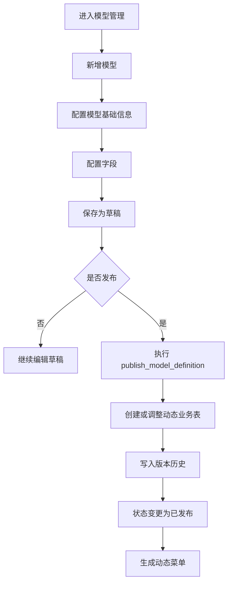
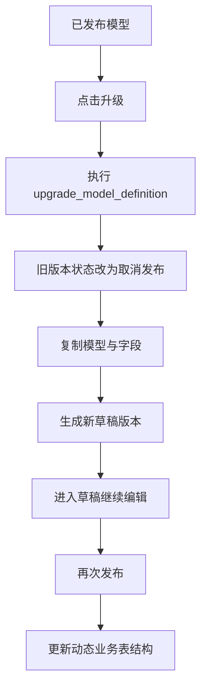
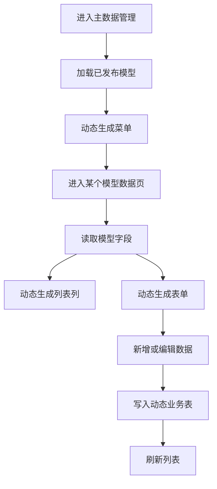
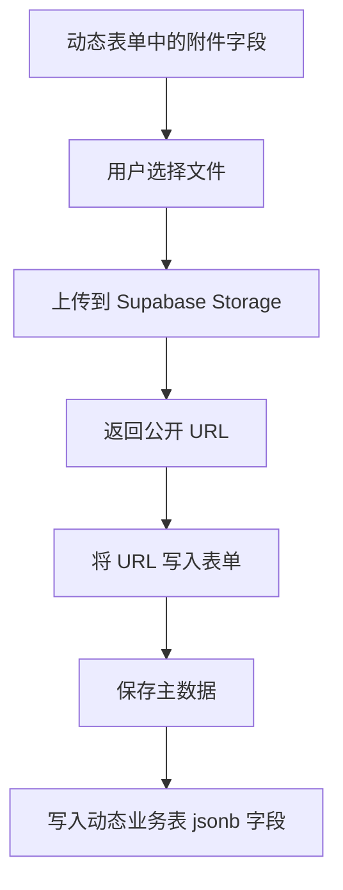
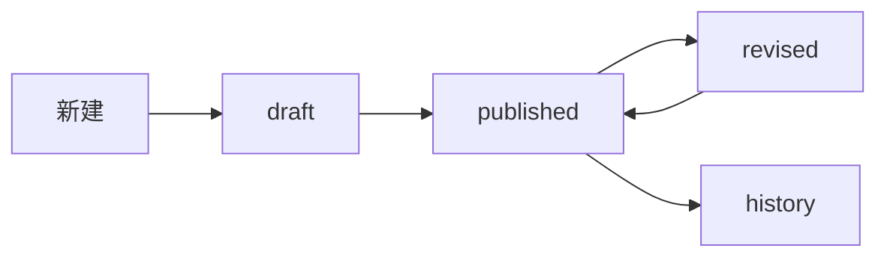

# MDM 项目文档

## 1. 项目概览

本项目在 `vben-admin` 基础上实现了一套 MDM 主数据管理能力，当前核心范围包括：

- 数据主题管理
- 数据模型定义管理
- 模型字段配置
- 模型版本升级与发布
- 动态菜单注册
- 动态主数据维护
- 用户、用户组管理
- 附件字段上传到 Supabase Storage

当前前端主应用位于：

- `apps/web-antd`

当前数据库增量 SQL 位于：

- `database/sql/2026-04-09-mdm-model-upgrade-fix.sql`
- `database/sql/2026-04-09-mdm-model-attachment-support.sql`
- `database/sql/2026-04-09-mdm-model-attachment-upload-support.sql`

---

## 2. 模块结构

### 2.1 数据建模

页面入口：

- `/mdm/model/theme`
- `/mdm/model/definition`

主要能力：

- 数据主题维护
- 数据模型维护
- 字段配置
- 版本历史
- 发布 / 取消发布 / 升级

关键文件：

- `apps/web-antd/src/views/mdm/model/definition/index.vue`
- `apps/web-antd/src/views/mdm/model/definition/modules/form.vue`
- `apps/web-antd/src/views/mdm/model/definition/modules/fields.vue`
- `apps/web-antd/src/views/mdm/model/definition/modules/field-form.vue`
- `apps/web-antd/src/api/mdm/model-definition.ts`

### 2.2 主数据管理

页面入口：

- `/mdm/data/...`

主要能力：

- 已发布模型自动生成动态菜单
- 根据模型字段生成动态列表列
- 根据模型字段生成动态表单
- 动态主数据新增、编辑
- 附件字段上传到 Supabase Storage

关键文件：

- `apps/web-antd/src/router/dynamic-mdm-data.ts`
- `apps/web-antd/src/views/mdm/data/shared/master-data.ts`
- `apps/web-antd/src/views/mdm/data/maintenance/index.vue`
- `apps/web-antd/src/views/mdm/data/maintenance/data.ts`
- `apps/web-antd/src/views/mdm/data/maintenance/modules/form.vue`
- `apps/web-antd/src/api/mdm/master-data.ts`
- `apps/web-antd/src/api/mdm/storage.ts`

### 2.3 系统管理

页面入口：

- `/mdm/system/user`
- `/mdm/system/user-group`

主要能力：

- 用户管理
- 用户组管理
- 用户组分配用户

关键文件：

- `apps/web-antd/src/views/mdm/system/user/index.vue`
- `apps/web-antd/src/views/mdm/system/user-group/index.vue`
- `apps/web-antd/src/views/mdm/system/user-group/modules/assign-users.vue`

---

## 3. 核心业务规则

### 3.1 模型状态

模型状态分为：

- `draft`：草稿
- `published`：已发布
- `unpublished`：取消发布

规则如下：

- 新增模型后默认是 `draft`
- 编辑草稿模型，保存后仍然是 `draft`
- 草稿模型可以点击“发布”
- 已发布模型不能直接改字段
- 已发布模型点击“升级”后，会生成一个新的草稿版本
- 升级后旧版本自动转成 `unpublished`

### 3.2 动态建表规则

模型发布时会自动根据字段配置生成或调整动态业务表：

- 表名规则：`mdm_data_<model_code>`
- 若表不存在，则自动创建
- 若字段新增，则自动加列
- 若字段删除，则自动删列
- 若字段类型变化，则尝试调整列类型
- 自动创建更新时间触发器
- 自动开启 RLS
- 自动创建 `authenticated` CRUD 策略

### 3.3 动态菜单规则

只有已发布模型会出现在“主数据管理”菜单下：

- 非动态静态菜单已移除
- 系统启动或首次鉴权时会拉取已发布模型
- 自动生成 `/mdm/data/<slug>` 路由和菜单

### 3.4 附件字段规则

当前附件字段类型为：

- `attachment`

扩展属性：

- `is_multiple`

存储规则：

- 文件上传到 Supabase Storage
- 动态业务表中附件字段统一建议使用 `jsonb`
- 表中保存 URL 数组

示例：

```json
[
  "https://xxx.supabase.co/storage/v1/object/public/mdm-files/mdm/mdm_data_contract/file/a.pdf"
]
```

多附件示例：

```json
[
  "https://xxx.supabase.co/storage/v1/object/public/mdm-files/mdm/mdm_data_contract/file/a.pdf",
  "https://xxx.supabase.co/storage/v1/object/public/mdm-files/mdm/mdm_data_contract/file/b.pdf"
]
```

---

## 4. 数据流程图

### 4.1 模型设计与发布流程



### 4.2 已发布模型升级流程



### 4.3 动态主数据维护流程



### 4.4 附件上传流程



---

## 5. 数据库对象说明

### 5.1 核心表

- `mdm_themes`
  - 数据主题
- `mdm_model_definitions`
  - 模型定义
- `mdm_model_fields`
  - 模型字段
- `mdm_model_versions`
  - 模型版本历史
- `mdm_model_migrations`
  - 发布迁移日志
- `mdm_user_groups`
  - 用户组
- `mdm_users`
  - 用户
- `mdm_data_*`
  - 动态业务表

### 5.2 核心函数

- `publish_model_definition(uuid)`
  - 发布模型并动态建表
- `unpublish_model_definition(uuid)`
  - 取消发布
- `upgrade_model_definition(uuid)`
  - 生成升级草稿

---

## 6. 字段类型字典

当前推荐字段类型字典如下：

```json
[
  { "label": "文本", "value": "text" },
  { "label": "短文本", "value": "varchar" },
  { "label": "整数", "value": "int4" },
  { "label": "数值", "value": "numeric" },
  { "label": "布尔", "value": "boolean" },
  { "label": "日期", "value": "date" },
  { "label": "时间", "value": "timestamptz" },
  { "label": "附件", "value": "attachment" }
]
```

附件是否支持多文件，不通过新增类型实现，而是通过：

- `is_multiple = true | false`

---

## 7. 执行顺序建议

首次落库建议按下面顺序执行：

1. 基础表结构与策略
   - `sql.md`
2. 模型升级与发布修复
   - `database/sql/2026-04-09-mdm-model-upgrade-fix.sql`
3. 附件字段支持
   - `database/sql/2026-04-09-mdm-model-attachment-support.sql`
4. 附件多选上传支持
   - `database/sql/2026-04-09-mdm-model-attachment-upload-support.sql`

如果线上已有旧结构，建议优先执行增量 SQL，不要整段重建。

---

## 8. Supabase 配置要求

环境变量示例：

```env
VITE_SUPABASE_URL=https://your-project.supabase.co
VITE_SUPABASE_ANON_KEY=your_anon_key
VITE_SUPABASE_STORAGE_BUCKET=mdm-files
```

要求：

- 已创建 bucket：`mdm-files`
- bucket 需要允许当前登录用户上传
- 动态业务表需要允许 `authenticated` 用户 CRUD

---

## 9. 当前已实现内容

- 模型列表单页化
- 草稿 / 已发布 / 取消发布状态流转
- 升级生成新草稿
- 旧发布版本自动取消发布
- 模型发布动态建表
- 动态菜单注册
- 动态主数据增改查
- 用户与用户组管理
- 用户组分配用户
- 附件字段上传到 Supabase Storage
- 单附件 / 多附件支持

---

## 10. 后续可扩展项

- 附件字段列表页渲染为下载链接/预览按钮
- 动态数据删除
- 动态数据审核流
- 附件上传大小、格式、数量限制
- 附件私有 bucket + 签名 URL
- 字段级权限控制
- 数据字典联动下拉选择

---

## 11. 数据模型功能设计（V2）

本章节用于约束后续“数据模型”功能的前后端重构，优先级高于当前原型实现。若现有页面、接口、数据库结构与本章节不一致，应以本章节为准进行调整。

### 11.1 数据模型主表字段

数据模型建议统一落表为 `mdm_model_definitions`，字段定义如下：

| 字段 | 必填 | 类型 | 说明 |
| --- | --- | --- | --- |
| 模型名称 `name` | 是 | varchar | 名称唯一 |
| 模型编码 `code` | 是 | varchar | 编码唯一，建议仅允许大写字母、数字、下划线 |
| 模型类型 `model_type` | 是 | varchar | 从数据字典 `mdm_model_type` 选择 |
| 版本号 `version_no` | 否 | integer | 编辑页不显示，默认从 `1` 开始，每次升级加 `1` |
| 排序号 `sort_no` | 是 | integer | 默认 `0` |
| 数据表 `table_name` | 否 | varchar | 编辑页不显示，固定规则为 `mdm_data_ + 模型编码` |
| 状态 `status` | 是 | varchar | 取值：`draft`、`published`、`history`、`revised` |
| 是否启用 `enabled` | 是 | boolean | 默认 `true` |
| 是否需要审核 `need_audit` | 是 | boolean | 默认 `false` |
| 审核人 `audit_group_id` | 否 | uuid | 默认带出所属数据主题的用户组，可改选其他用户组 |
| 所属组 `group_id` | 否 | uuid | 指模型归属的业务/权限组，需与主题、授权体系对齐 |
| 备注 `remark` | 否 | text | 补充说明 |
| 创建人 `created_by` | 否 | uuid/varchar | 第一次保存时记录 |
| 创建时间 `created_at` | 否 | timestamptz | 第一次保存时记录 |
| 更新人 `updated_by` | 否 | uuid/varchar | 每次保存或修改时更新 |
| 更新时间 `updated_at` | 否 | timestamptz | 每次保存或修改时更新 |

补充约束：

- `table_name` 不允许手工修改，服务端统一生成并保存。
- `name`、`code` 需要建立唯一约束，唯一性校验必须以前后端双校验实现。
- `audit_group_id` 默认取所属数据主题的用户组；若主题未配置默认组，允许为空。
- `group_id` 与 `audit_group_id` 语义不同，前者表示模型归属，后者表示审核责任组，设计时不要混用。

### 11.2 模型类型字典

模型类型不再写死在前端枚举中，必须改为后台数据字典驱动。

建议增加以下字典数据：

- 字典编码：`mdm_model_type`
- 字典名称：`模型类型`
- 字典条目：`普通模型`、`组合模型`

相关要求：

- “数据字典”功能需从前端 mock 调整为数据库持久化模式。
- 模型表单中的“模型类型”下拉框统一从字典接口读取。
- 后续如新增模型类型，只允许通过数据字典维护，不再改代码常量。

### 11.3 状态机规则

数据模型状态统一为以下四种：

- `draft`：草稿
- `published`：已发布
- `history`：历史
- `revised`：修订

状态说明：

- 新建模型后默认进入 `draft`。
- 草稿发布后进入 `published`。
- 已发布模型发起修订后，生成新版本，状态进入 `revised`。
- 被新版本替代的旧发布版本转为 `history`。
- 列表页不显示 `history` 状态的数据。

建议状态流转如下：



落地约束：

- `history` 仅用于历史追溯，不允许在业务列表中直接维护。
- `revised` 不是“已发布”的别名，而是“修订中的可编辑版本”。
- 每次从已发布版本发起修订时，新版本 `version_no = 旧版本 + 1`。

### 11.4 数据模型列表

列表显示要求：

- 不显示 `history` 状态模型。
- 显示字段至少包含：模型名称、模型编码、模型类型、版本号、排序号、数据表、状态、是否启用、是否需要审核、审核人、所属组、备注、更新人、更新时间。

列表操作统一为：

- 编辑
- 删除
- 启用
- 禁用
- 模型管理

按钮显示规则：

- 编辑：所有状态均显示，但可编辑字段范围受状态限制。
- 删除：仅 `draft`、`revised` 状态显示。
- 启用：仅 `published` 且 `enabled = false` 时显示。
- 禁用：仅 `published` 且 `enabled = true` 时显示。
- 模型管理：所有非 `history` 状态均显示。

### 11.5 列表操作规则

#### 11.5.1 编辑

不同状态下可编辑范围如下：

- `draft`：允许修改全部业务字段。
- `published`、`revised`、`history`：仅允许修改 `name`、`remark`、`need_audit`、`audit_group_id`，其他字段置灰只读。

补充说明：

- 虽然 `history` 不在列表中显示，但详情/历史记录页若允许查看，也必须遵守只读限制。
- `table_name`、`version_no`、`created_by`、`created_at` 始终不可编辑。

#### 11.5.2 删除

- `draft`：允许删除。
- `revised`：允许删除。
- `published`、`history`：不允许删除，也不显示删除按钮。

#### 11.5.3 启用 / 禁用

- 仅对 `published` 状态开放。
- 启用/禁用只改变 `enabled`，不改变模型发布状态。
- 禁用后的模型默认不应出现在主数据维护入口，除非业务明确要求“允许查看不可维护”。

### 11.6 模型管理页

点击“模型管理”后，要求打开新的导航页签，而不是弹窗或抽屉。

页面结构：

- 左侧：模型基本信息区
- 右侧：页签区

右侧页签包含：

- 字段管理
- 显示配置
- 授权
- 模型关系

默认页签：

- 字段管理

实现建议：

- 新增独立路由，如 `/mdm/model/definition/:id/manage`。
- 路由 meta 中保留模型名称，便于标签页标题动态展示。
- 左侧模型信息建议展示：名称、编码、类型、版本、状态、是否启用、审核配置、所属组、备注。

### 11.7 字段管理

在保留现有字段定义的基础上，新增字段：

- 校验规则 `rule_id` / `rule_ids`

取值来源：

- 从菜单“校验规则”配置数据中获取。
- “校验规则”页面必须补齐真实后端交互程序，不能继续使用 mock 常量。

字段管理操作：

- 新增字段
- 编辑
- 删除
- 启用
- 禁用

按钮规则：

- 新增字段：仅 `draft`、`revised` 状态可见。
- 编辑：仅 `draft`、`revised` 状态可见。
- 删除：仅 `draft` 状态可见。
- 启用/禁用：建议仅 `draft`、`revised` 状态可操作；若后续允许已发布字段停启用，需要补充发布影响评估。

编辑限制：

- `draft`：允许修改全部字段属性。
- `revised`：仅允许修改 `name`、`length`、`precision`、`sort`、`default_value`、`remark`。

说明：

- 修订状态下不允许修改字段编码、数据类型、主键属性、唯一性、必填性等会影响表结构或历史兼容性的内容。
- 若需要调整结构型属性，应通过“新增版本 + 数据迁移策略”单独设计，不应直接覆盖。

### 11.8 显示配置

显示配置页签用于维护模型字段分组与展示顺序。

需求要求：

- 可添加分组。
- 可在分组区域内选择字段。
- 同一字段只能属于一个分组。
- 推荐左右结构：
  - 左侧显示所有未分组字段
  - 右侧显示分组区块
- 支持通过拖拽将左侧字段拖入右侧分组，完成归组动作。

建议数据结构：

- 分组主表：`mdm_model_display_groups`
- 分组字段关系表：`mdm_model_display_group_fields`

关键约束：

- 同一 `field_id` 在同一模型下只能出现一次。
- 分组需要支持排序，字段在组内也需要支持排序。
- 删除分组时，组内字段应回到“未分组”池，而不是被删除。

### 11.9 数据字典改造要求

当前数据字典页面仍为 mock 数据，需改造成数据库持久化模式。

建议表结构：

- `mdm_dicts`：字典主表
- `mdm_dict_items`：字典条目表

最少能力：

- 字典分类增删改查
- 字典条目增删改查
- 启用/禁用
- 排序
- 通过 `code` 查询字典及条目

接口建议：

- `GET /dicts`
- `GET /dicts/:code/items`
- `POST /dicts`
- `PATCH /dicts/:id`
- `DELETE /dicts/:id`
- `POST /dict-items`
- `PATCH /dict-items/:id`
- `DELETE /dict-items/:id`

落地要求：

- `模型类型` 必须作为初始化字典数据写入数据库。
- 所有枚举型下拉项后续优先接入数据字典，不再散落在各页面常量中。

### 11.10 校验规则模块改造要求

当前“校验规则”页面存在前端原型，但尚未接真实后端。

改造目标：

- 提供校验规则主数据维护能力。
- 支持字段管理页通过接口拉取规则列表。
- 后续支持录入校验、发布校验、批量导入校验复用同一规则源。

建议表结构：

- `mdm_validation_rules`

建议字段：

- `name`
- `code`
- `rule_type`
- `expression`
- `error_message`
- `status`
- `sort_no`
- `remark`
- `theme_id`

规则类型建议至少支持：

- 正则
- 唯一性
- 数值范围
- 长度范围
- 自定义表达式

### 11.11 审计字段与默认值

审计字段统一要求：

- 首次保存时写入 `created_by`、`created_at`。
- 每次保存均更新 `updated_by`、`updated_at`。
- 若系统使用 Supabase，建议通过触发器或统一服务层写入，不要依赖前端传值保证一致性。

默认值统一要求：

- `version_no = 1`
- `sort_no = 0`
- `status = draft`
- `enabled = true`
- `need_audit = false`

### 11.12 与当前实现的差异

当前仓库实现与本设计的主要差异如下：

- 当前模型状态为 `draft / published / unpublished`，需调整为 `draft / published / history / revised`。
- 当前“字段配置”采用抽屉模式，需调整为“模型管理”独立页签模式。
- 当前“数据字典”与“校验规则”仍以前端 mock 为主，需补后端持久化。
- 当前模型表单字段偏少，尚未覆盖模型类型、排序号、审核配置、所属组、启停用等字段。
- 当前字段管理尚未支持“校验规则”关联与“显示配置”分组拖拽。
