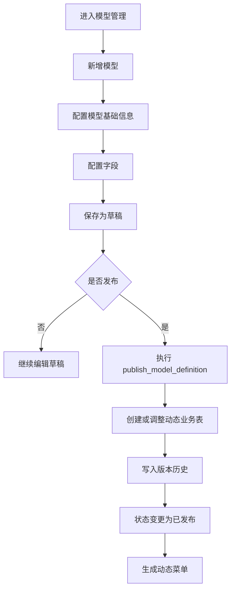
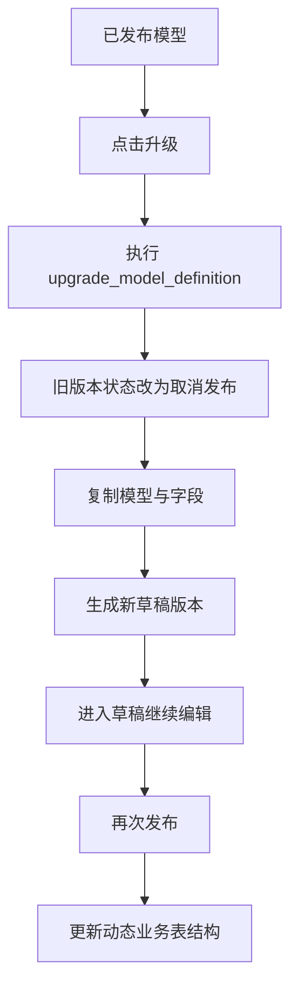
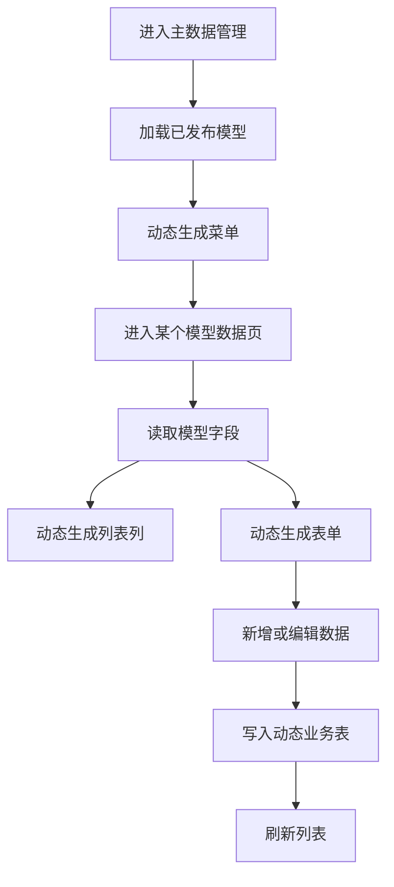
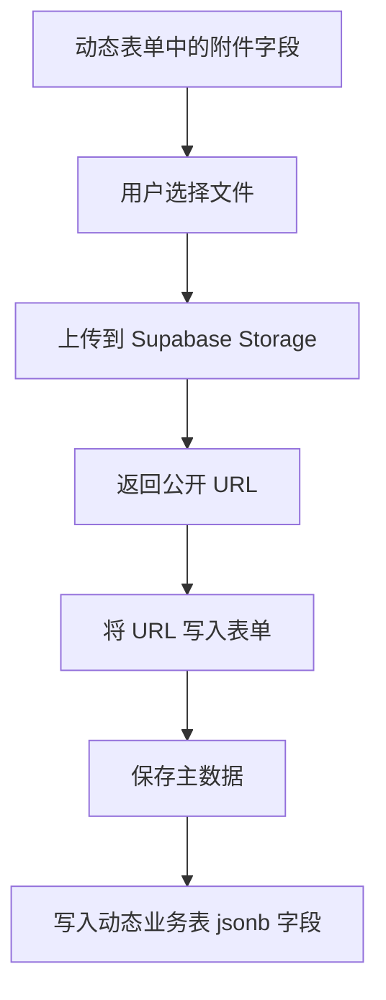

# MDM 项目文档

## 1. 项目概览

本项目在 `vben-admin` 基础上实现了一套 MDM 主数据管理能力，当前核心范围包括：

- 数据主题管理
- 数据模型定义管理
- 模型字段配置
- 模型版本升级与发布
- 动态菜单注册
- 动态主数据维护
- 用户、用户组管理
- 附件字段上传到 Supabase Storage

当前前端主应用位于：

- `apps/web-antd`

当前数据库增量 SQL 位于：

- `database/sql/2026-04-09-mdm-model-upgrade-fix.sql`
- `database/sql/2026-04-09-mdm-model-attachment-support.sql`
- `database/sql/2026-04-09-mdm-model-attachment-upload-support.sql`

---

## 2. 模块结构

### 2.1 数据建模

页面入口：

- `/mdm/model/theme`
- `/mdm/model/definition`

主要能力：

- 数据主题维护
- 数据模型维护
- 字段配置
- 版本历史
- 发布 / 取消发布 / 升级

关键文件：

- `apps/web-antd/src/views/mdm/model/definition/index.vue`
- `apps/web-antd/src/views/mdm/model/definition/modules/form.vue`
- `apps/web-antd/src/views/mdm/model/definition/modules/fields.vue`
- `apps/web-antd/src/views/mdm/model/definition/modules/field-form.vue`
- `apps/web-antd/src/api/mdm/model-definition.ts`

### 2.2 主数据管理

页面入口：

- `/mdm/data/...`

主要能力：

- 已发布模型自动生成动态菜单
- 根据模型字段生成动态列表列
- 根据模型字段生成动态表单
- 动态主数据新增、编辑
- 附件字段上传到 Supabase Storage

关键文件：

- `apps/web-antd/src/router/dynamic-mdm-data.ts`
- `apps/web-antd/src/views/mdm/data/shared/master-data.ts`
- `apps/web-antd/src/views/mdm/data/maintenance/index.vue`
- `apps/web-antd/src/views/mdm/data/maintenance/data.ts`
- `apps/web-antd/src/views/mdm/data/maintenance/modules/form.vue`
- `apps/web-antd/src/api/mdm/master-data.ts`
- `apps/web-antd/src/api/mdm/storage.ts`

### 2.3 系统管理

页面入口：

- `/mdm/system/user`
- `/mdm/system/user-group`

主要能力：

- 用户管理
- 用户组管理
- 用户组分配用户

关键文件：

- `apps/web-antd/src/views/mdm/system/user/index.vue`
- `apps/web-antd/src/views/mdm/system/user-group/index.vue`
- `apps/web-antd/src/views/mdm/system/user-group/modules/assign-users.vue`

---

## 3. 核心业务规则

### 3.1 模型状态

模型状态分为：

- `draft`：草稿
- `published`：已发布
- `unpublished`：取消发布

规则如下：

- 新增模型后默认是 `draft`
- 编辑草稿模型，保存后仍然是 `draft`
- 草稿模型可以点击“发布”
- 已发布模型不能直接改字段
- 已发布模型点击“升级”后，会生成一个新的草稿版本
- 升级后旧版本自动转成 `unpublished`

### 3.2 动态建表规则

模型发布时会自动根据字段配置生成或调整动态业务表：

- 表名规则：`mdm_data_<model_code>`
- 若表不存在，则自动创建
- 若字段新增，则自动加列
- 若字段删除，则自动删列
- 若字段类型变化，则尝试调整列类型
- 自动创建更新时间触发器
- 自动开启 RLS
- 自动创建 `authenticated` CRUD 策略

### 3.3 动态菜单规则

只有已发布模型会出现在“主数据管理”菜单下：

- 非动态静态菜单已移除
- 系统启动或首次鉴权时会拉取已发布模型
- 自动生成 `/mdm/data/<slug>` 路由和菜单

### 3.4 附件字段规则

当前附件字段类型为：

- `attachment`

扩展属性：

- `is_multiple`

存储规则：

- 文件上传到 Supabase Storage
- 动态业务表中附件字段统一建议使用 `jsonb`
- 表中保存 URL 数组

示例：

```json
[
  "https://xxx.supabase.co/storage/v1/object/public/mdm-files/mdm/mdm_data_contract/file/a.pdf"
]
```

多附件示例：

```json
[
  "https://xxx.supabase.co/storage/v1/object/public/mdm-files/mdm/mdm_data_contract/file/a.pdf",
  "https://xxx.supabase.co/storage/v1/object/public/mdm-files/mdm/mdm_data_contract/file/b.pdf"
]
```

---

## 4. 数据流程图

### 4.1 模型设计与发布流程



### 4.2 已发布模型升级流程



### 4.3 动态主数据维护流程



### 4.4 附件上传流程



---

## 5. 数据库对象说明

### 5.1 核心表

- `mdm_themes`
  - 数据主题
- `mdm_model_definitions`
  - 模型定义
- `mdm_model_fields`
  - 模型字段
- `mdm_model_versions`
  - 模型版本历史
- `mdm_model_migrations`
  - 发布迁移日志
- `mdm_user_groups`
  - 用户组
- `mdm_users`
  - 用户
- `mdm_data_*`
  - 动态业务表

### 5.2 核心函数

- `publish_model_definition(uuid)`
  - 发布模型并动态建表
- `unpublish_model_definition(uuid)`
  - 取消发布
- `upgrade_model_definition(uuid)`
  - 生成升级草稿

---

## 6. 字段类型字典

当前推荐字段类型字典如下：

```json
[
  { "label": "文本", "value": "text" },
  { "label": "短文本", "value": "varchar" },
  { "label": "整数", "value": "int4" },
  { "label": "数值", "value": "numeric" },
  { "label": "布尔", "value": "boolean" },
  { "label": "日期", "value": "date" },
  { "label": "时间", "value": "timestamptz" },
  { "label": "附件", "value": "attachment" }
]
```

附件是否支持多文件，不通过新增类型实现，而是通过：

- `is_multiple = true | false`

---

## 7. 执行顺序建议

首次落库建议按下面顺序执行：

1. 基础表结构与策略
   - `sql.md`
2. 模型升级与发布修复
   - `database/sql/2026-04-09-mdm-model-upgrade-fix.sql`
3. 附件字段支持
   - `database/sql/2026-04-09-mdm-model-attachment-support.sql`
4. 附件多选上传支持
   - `database/sql/2026-04-09-mdm-model-attachment-upload-support.sql`

如果线上已有旧结构，建议优先执行增量 SQL，不要整段重建。

---

## 8. Supabase 配置要求

环境变量示例：

```env
VITE_SUPABASE_URL=https://your-project.supabase.co
VITE_SUPABASE_ANON_KEY=your_anon_key
VITE_SUPABASE_STORAGE_BUCKET=mdm-files
```

要求：

- 已创建 bucket：`mdm-files`
- bucket 需要允许当前登录用户上传
- 动态业务表需要允许 `authenticated` 用户 CRUD

---

## 9. 当前已实现内容

- 模型列表单页化
- 草稿 / 已发布 / 取消发布状态流转
- 升级生成新草稿
- 旧发布版本自动取消发布
- 模型发布动态建表
- 动态菜单注册
- 动态主数据增改查
- 用户与用户组管理
- 用户组分配用户
- 附件字段上传到 Supabase Storage
- 单附件 / 多附件支持

---

## 10. 后续可扩展项

- 附件字段列表页渲染为下载链接/预览按钮
- 动态数据删除
- 动态数据审核流
- 附件上传大小、格式、数量限制
- 附件私有 bucket + 签名 URL
- 字段级权限控制
- 数据字典联动下拉选择

